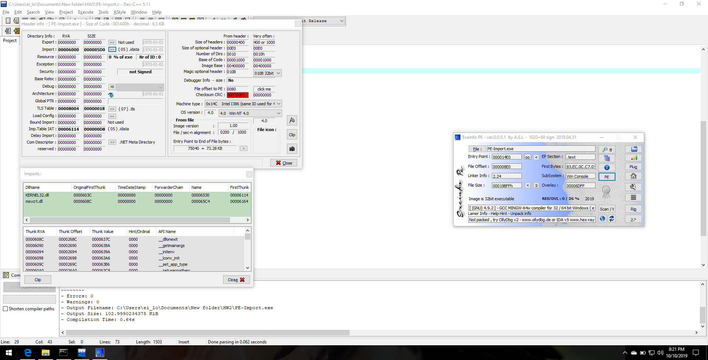
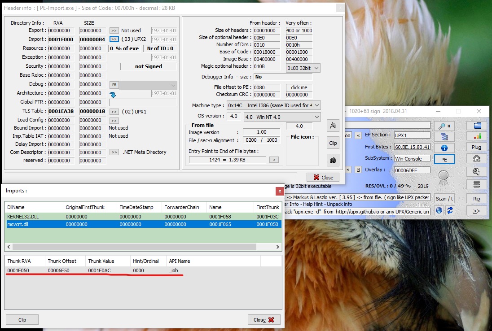
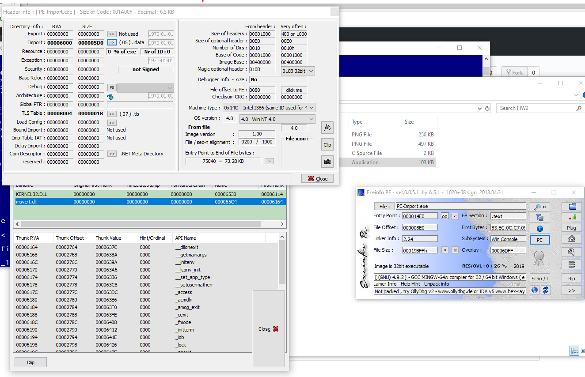

# eecs349-hw2-q1
# Emilio Lopez, eil11

# Step 1
See PE-Import.c for my implementation. It's not terribly robust for checking whether the String exists within the file, but I think it's sufficient for the purpose of the assignment. 

# Step 2

As one can see, the msvcrt.dll contents are visible, since the file has not been packed or obfuscated yet. 

# Step 3

However, by comparison, after packing with UPX, ExeInfo can display very little information about the packed executable. 

After unpacking, however, the contents of msvcrt.dll are available. 

# Step 4

I initially uploaded PE-Import.exe, and it was flagged by 3 scanners as malicious. 