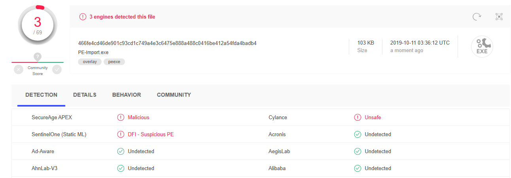
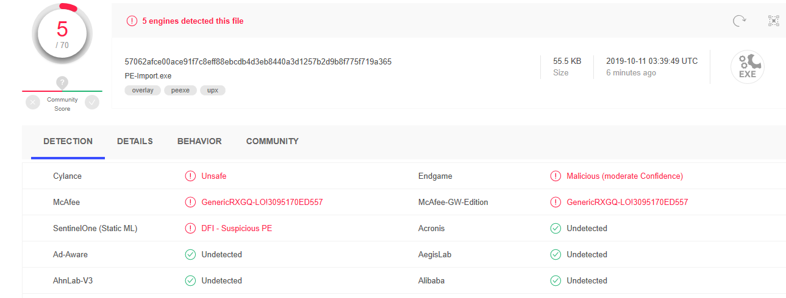

# eecs349-hw2-q1
# Emilio Lopez, eil11

# Step 1
See PE-Import.c for my implementation. It's not terribly robust for checking whether the String exists within the file, but I think it's sufficient for the purpose of the assignment. 

# Step 2

As one can see, the msvcrt.dll contents are visible, since the file has not been packed or obfuscated yet. 

# Step 3

However, by comparison, after packing with UPX, ExeInfo can display very little information about the packed executable. 

After unpacking, however, the contents of msvcrt.dll are available. 

# Step 4

I initially uploaded PE-Import.exe, and it was flagged by 3 scanners as malicious. 

I expected more scanners to flag this as a malicious file.

I employed the following techniques: I used UPX on the PE-Import.exe. Then, I used the Windows 10 built-in encryption on the file to use further techniques. 

However, paradoxically, more scanners on VirusTotal flagged the file as suspicious:

I am confused as to how this might happen, since it was my understand that the tools should have helped to mask the "malicious" behavior of the tool. This might be advantageous to attackers, who could make the saturate these scanners with false positives, making them less helpful for white-hat users. 